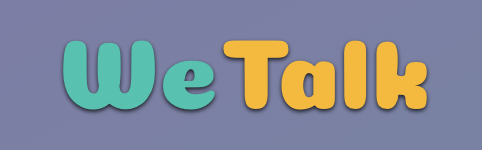
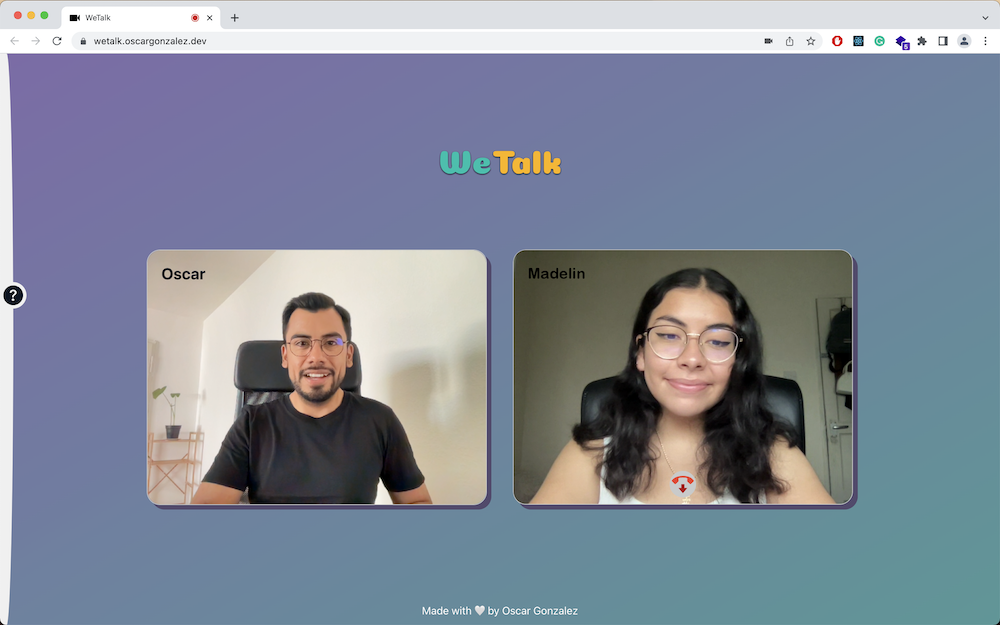

<a name="readme-top"></a>

<!-- PROJECT LOGO -->
                
<div align="center">

[![Contributors][contributors-shield]][contributors-url]
[![Forks][forks-shield]][forks-url]
[![Stargazers][stars-shield]][stars-url]
[![Issues][issues-shield]][issues-url]
[![MIT License][license-shield]][license-url]
[![LinkedIn][linkedin-shield]][linkedin-url]

<br />
<br />

  <a href="https://github.com/oscargonzalezdev/video-call-app">
    
  </a>

  <p align="center">
    Video Call Web Application
    <br />
    <a href="https://wetalk.oscargonzalez.dev">View Demo</a>
    ·
    <a href="https://github.com/oscargonzalezdev/video-call-app/issues/new">Report Bug</a>
    ·
    <a href="https://www.buymeacoffee.com/oscardev">Support</a>
  </p>
</div>

<br/>
<!-- TABLE OF CONTENTS -->
<details>
  <summary>Table of Contents</summary>
  <ol>
    <li>
      <a href="#about-the-project">About The Project</a>
      <ul>
        <li><a href="#built-with">Built With</a></li>
      </ul>
    </li>
    <li>
      <a href="#getting-started">Getting Started</a>
      <ul>
        <li><a href="#installation">Installation</a></li>
      </ul>
    </li>
    <li><a href="#usage">Usage</a></li>
    <li><a href="#roadmap">Roadmap</a></li>
    <li><a href="#contributing">Contributing</a></li>
    <li><a href="#license">License</a></li>
    <li><a href="#contact">Contact</a></li>
    <li><a href="#links">Links</a></li>
  </ol>
</details>

<br/>

<!-- ABOUT THE PROJECT -->
## About The Project

[](https://wetalk.oscargonzalez.dev)


WeTalk is a video call web application based on WebRTC, this technology allows peer-to-peer communications in real-time using web browsers.


### Built With

* <strong>React</strong> for the frontend.
* <strong>Express</strong> for the server side.
* <strong>Socket.io</strong> for handling signals between server and client.
* <strong>Chackra UI</strong> for UI styling.
* <strong>JavaScript, HTML, CSS</strong> as a general stack to build web applications.


<!-- GETTING STARTED -->
## Getting Started

To get and run a local copy of this project follow the instructions below.

### Installation

1. Clone the repo
   ```sh
   git clone https://github.com/oscargonzalezdev/video-call-app.git
   ```
2. Install NPM packages
   ```sh
   npm i socket.io-client simple-peer react-icons  @chakra-ui/react react-copy-to-clipboard
   ```
3. Run the project locally
   ```sh
   npm start
   ```


<!-- USAGE EXAMPLES -->
## Usage

How can I make a Video Call?

That is very easy. First, you need the Call ID of your friend. Then paste it in the corresponding input and click the video call icon and Voila!


<!-- ROADMAP -->
## Roadmap

- [X] Server-Side.
- [X] Client-Side.
- [X] Access component to get user name.
- [x] Options component handle Call IDs.
- [X] VideoPlayer component to render Video Stream.
- [X] Notifications component to notify incoming calls.
- [ ] CallOptions component to control the availability of video and audio.
- [ ] Chat component.
- [ ] ShareScrren component.
- [ ] Storage to allow user accounts.

See the [open issues](https://github.com/oscargonzalezdev/video-call-app/issues) for a full list of proposed features (and known issues).


<!-- CONTRIBUTING -->
## Contributing

Contributions are what make the open source community such an amazing place to learn, inspire, and create. Any contributions you make are **greatly appreciated**.

If you have a suggestion that would make this better, please fork the repo and create a pull request. You can also simply open an issue with the tag "enhancement".
Don't forget to give the project a star! Thanks again!

1. Fork the Project
2. Create your Feature Branch (`git checkout -b feature/AmazingFeature`)
3. Commit your Changes (`git commit -m 'Add some AmazingFeature'`)
4. Push to the Branch (`git push origin feature/AmazingFeature`)
5. Open a Pull Request


<!-- LICENSE -->
## License

Distributed under the MIT License. See `LICENSE.txt` for more information.


<!-- CONTACT -->
## Contact Author

[www.oscargonzalez.dev](https://oscargonzalez.dev) |
[Twitter](https://twitter.com/oscardev_) |
[LinkedIn](https://linkedin.com/in/oscargonzalezdev)


<!-- RESOURCES -->
## Links

- App Client-Side: [https://github.com/oscargonzalezdev/video-call-app](https://github.com/oscargonzalezdev/video-call-app)
- App Server-Side: [https://github.com/oscargonzalezdev/video-call-server](https://github.com/oscargonzalezdev/video-call-server)

- To learn more about WebRTC visit [www.webrtc.org](https://webrtc.org)

<p align="right">(<a href="#readme-top">back to top</a>)</p>

<!-- MARKDOWN LINKS & IMAGES -->
<!-- https://www.markdownguide.org/basic-syntax/#reference-style-links -->
[contributors-shield]: https://img.shields.io/github/contributors/oscargonzalezdev/video-call-app.svg?style=for-the-badge
[contributors-url]: https://github.com/oscargonzalezdev/video-call-app/graphs/contributors
[forks-shield]: https://img.shields.io/github/forks/oscargonzalezdev/video-call-app.svg?style=for-the-badge
[forks-url]: https://github.com/oscargonzalezdev/video-call-app/network/members
[stars-shield]: https://img.shields.io/github/stars/oscargonzalezdev/video-call-app.svg?style=for-the-badge
[stars-url]: https://github.com/oscargonzalezdev/video-call-app/stargazers
[issues-shield]: https://img.shields.io/github/issues/oscargonzalezdev/video-call-app.svg?style=for-the-badge
[issues-url]: https://github.com/oscargonzalezdev/video-call-app/issues
[license-shield]: https://img.shields.io/github/license/oscargonzalezdev/video-call-app.svg?style=for-the-badge
[license-url]: https://github.com/oscargonzalezdev/video-call-app/blob/master/LICENSE.txt
[linkedin-shield]: https://img.shields.io/badge/-LinkedIn-black.svg?style=for-the-badge&logo=linkedin&colorB=555
[linkedin-url]: https://linkedin.com/in/oscargonzalezdev
